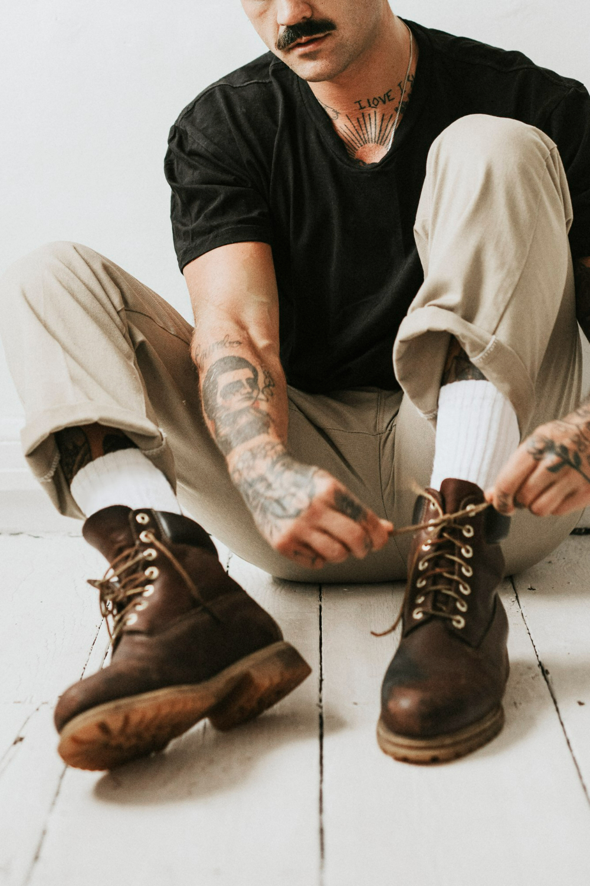

<!DOCTYPE html>
<html lang="pt-br">
  <head>
    <meta charset="UTF-8" />
    <meta name="viewport" content="width=device-width, initial-scale=1.0" />
    <link rel="stylesheet" href="css/style.css" />
    <link
      rel="stylesheet"
      href="https://cdnjs.cloudflare.com/ajax/libs/font-awesome/6.5.2/css/all.min.css"
    />
    <title>GreenTech</title>
    
  </head>
  <body>
    <header style="background-image: url('imagens/banner.png')">
      

        <nav style="position: relative">
          
          <ul class="ul">
            <a class="btn" href="produtos.html">Produtos</a>
            <a class="btn" href="sobre.html">sobre</a>
            <a class="btn" href="contato.html">contato</a>
            <a class="btn" href="politica-privacidade.html">Politica-Privacidade</a>
            <a class="btn" href="termos-servico.html">Termos de Serviços</a>
          </ul>
        </nav>
       
      

      <!--final do container-->
    </header>
    <!--final do header-->
    <main>
    <section class="sobre">
      

        

          

            <h2>Bota De Couro Premium “Estilo & Classe”</h2>
            

              Descubra o equilíbrio perfeito entre robustez e sofisticação com a Bota Couro Premium Estilo & Classe.
              Fabricada em couro legítimo de alta durabilidade, ela oferece conforto e elegância em cada passo. Seu design clássico com cadarços metálicos reforçados e solado resistente garante firmeza e estilo, ideal para o homem moderno que valoriza autenticidade e presença.
            

            

              

                <h3>Destaques do produto</h3>
                

                  Material:Couro legítimo premium 
                  Solado: Borracha antiderrapante
                  Fechamento: Cadarço reforçado
                  Cor: Marrom rústico elegante
                  Conforto interno com palmilha macia
                  Ideal para looks casuais e urbanos

                

              

              

                <h3>Visão</h3>
                

                  Ser reconhecida como referência em sustentabilidade acessível
                  e em práticas que harmonizam crescimento econômico e
                  preservação ambiental.
                

              

            

          

          

            
          

        

      

    </section>
  </main>
    <footer class="rodape">
      

        

          <h3>Estilo & Classe</h3>
          
Elegance 123 - Centro

          
Cidade Estilus - BR

          
styleclass@gmail.com

        

        

          <h4>Nos siga</h4>
          

            <a href="#" aria-label="Facebook"
              ><i class="fa-brands fa-facebook-f"></i
            ></a>
            <a href="#" aria-label="Instagram"
              ><i class="fa-brands fa-instagram"></i
            ></a>
            <a href="#" aria-label="X"
              ><i class="fa-brands fa-x-twitter"></i
            ></a>
            <a href="#" aria-label="LinkedIn"
              ><i class="fa-brands fa-linkedin-in"></i
            ></a>
          

        

      

      

        
© 2025 Estilo & Classe. Todos os direitos reservados.

      

    </footer>
  </body>
</html>
